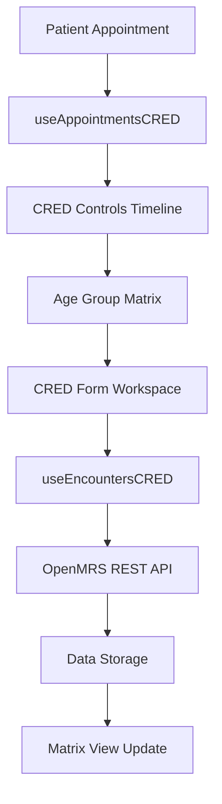

# CRED Module Documentation

## Overview

The **CRED Module** (Control de Crecimiento y Desarrollo - Growth and Development Control) is a comprehensive well-child care system for monitoring healthy child development in Peru's healthcare system. It provides age-based health monitoring, appointment scheduling, and comprehensive health assessments for children from birth through 11 years of age.

## Core Components

### 1. Main Hook Files

#### useAppointmentsCRED.ts
- **Location**: `src/hooks/useAppointmentsCRED.ts`
- **Purpose**: Fetches upcoming CRED appointments for patients
- **Key Features**:
  - Retrieves scheduled CRED appointments
  - Integrates with appointment management system
  - Supports appointment-based CRED control creation

#### useEncountersCRED.ts  
- **Location**: `src/hooks/useEncountersCRED.ts`
- **Purpose**: Manages historical CRED encounters and data
- **Key Features**:
  - Retrieves past CRED encounters
  - Categorizes encounters by type ('CRED' or 'Complementaria')
  - Links encounters to appropriate age groups
  - Supports encounter deletion and editing

#### useCreateCarePlanAppointments.ts
- **Location**: `src/hooks/useCreateCarePlanAppointments.ts`
- **Purpose**: Creates care plan appointments for CRED services
- **Key Features**:
  - Generates appointment schedules
  - Integrates with care planning workflow

### 2. Component Architecture

#### CRED Controls Timeline
- **Location**: `src/well-child-care/components/cred-controls-timeline/`
- **Components**:
  - `cred-controls-timeline.component.tsx` - Main timeline view with age-based controls
  - `cred-matrix.component.tsx` - Matrix view organizing encounters by age groups
  - `cred-checkups.component.tsx` - Individual CRED checkup management
  - `cred-tile.tsx` - Individual encounter tiles showing control numbers and dates

#### Well Child Control Workspace
- **Location**: `src/well-child-care/workspace/well-child-control/`
- **Component**: `well-child-controls-form.workspace.tsx`
- **Purpose**: Comprehensive form for creating and editing CRED encounters

## Age-Based CRED Groups

The system defines 13 standardized age groups following Peru's national guidelines:

| Age Group | Age Range | Code |
|-----------|-----------|------|
| RECIÉN NACIDO | 0-29 days | RN |
| 0 AÑOS | 1-11 months | 0A |
| 1 AÑO | 12-23 months | 1A |
| 2 AÑOS | 24-35 months | 2A |
| 3 AÑOS | 36-47 months | 3A |
| 4 AÑOS | 48-59 months | 4A |
| 5 AÑOS | 60-71 months | 5A |
| 6 AÑOS | 72-83 months | 6A |
| 7 AÑOS | 84-95 months | 7A |
| 8 AÑOS | 96-107 months | 8A |
| 9 AÑOS | 108-119 months | 9A |
| 10 AÑOS | 120-131 months | 10A |
| 11 AÑOS | 132-143 months | 11A |

## Key Functionality

### 1. Comprehensive Health Assessment

The CRED form includes the following sections:

#### Consultation Details
- Date and time of visit
- Reason for consultation
- Healthcare provider information

#### Age-Specific Danger Signs Assessment
- Customized danger signs based on child's age group
- Red flag symptom identification
- Emergency referral indicators

#### Risk Factors Evaluation
- Social and environmental risk factors
- Family history assessment
- Developmental risk indicators

#### Vital Signs Monitoring
- Height, weight, head circumference
- Vital signs appropriate for age
- Growth chart plotting

#### Physical Examination
- Systematic head-to-toe examination
- Age-appropriate developmental milestones
- Neurological assessment

#### Diagnoses and Classifications
- **Growth Assessment**: Normal, malnutrition, obesity
- **Nutritional Status**: Nutritional classifications
- **Psychomotor Development**: Developmental milestone tracking

#### Treatment and Care Plans
- Therapeutic interventions
- Nutritional guidance
- Developmental stimulation plans

#### Agreements and Referrals
- Follow-up appointments
- Specialist referrals when needed
- Family agreements and commitments

### 2. Matrix View Organization

The matrix view provides:
- **Age Group Columns**: Organized by the 13 standardized age groups
- **Encounter Tiles**: Visual representation of each CRED control
- **Control Numbers**: Sequential numbering of encounters
- **Date Tracking**: Clear visualization of encounter dates
- **Deletion Capability**: User-created encounters can be removed

### 3. Appointment Integration

- **Upcoming Appointments**: Display of scheduled CRED appointments
- **Quick Control Creation**: Direct creation of CRED controls from appointments
- **Status Tracking**: Appointment completion status
- **Scheduling Integration**: Seamless integration with appointment management

## Dashboard Integration

### Navigation Structure
- **Main Group**: "Curso de Vida del Niño" (Child's Life Course)
- **Dashboard Tabs**:
  - Following (Seguimiento)
  - CRED Controls (Controles CRED)
  - Non-CRED Controls (Controles No CRED)
  - Additional Services (Servicios Adicionales)

### Configuration
- **Encounter Type**: `healthyChildControl`
- **Age Group Configuration**: `ageGroupsCRED`
- **Form UUIDs**: Various CRED-related forms configured in system

## Data Flow

## Technical Integration

### Dependencies
- **OpenMRS REST API**: For data persistence
- **SWR**: For data fetching and caching
- **React**: Component framework
- **TypeScript**: Type safety

### Form Integration
- **OpenMRS Forms**: Integration with form engine
- **Validation**: Client-side and server-side validation
- **Data Mapping**: Automatic mapping to OpenMRS observations

### Styling
- **SCSS Modules**: Component-specific styling
- **Responsive Design**: Mobile and desktop compatibility
- **Accessibility**: ARIA compliance and keyboard navigation

## Configuration Management

### Age Group Configuration
- **Source**: System configuration files
- **Customization**: Age ranges can be adjusted per implementation
- **Validation**: Automatic age group assignment based on patient birthdate

### Form Configuration
- **UUIDs**: Form identifiers for different CRED types
- **Concepts**: Medical concept mappings for observations
- **Validation Rules**: Age-appropriate validation rules

## Best Practices

### Data Entry
1. **Complete Assessments**: Ensure all age-appropriate sections are completed
2. **Accurate Dating**: Verify encounter dates align with patient age
3. **Growth Tracking**: Maintain consistent measurement techniques
4. **Documentation**: Complete narrative notes for complex cases

### System Usage
1. **Regular Updates**: Keep patient information current
2. **Appointment Scheduling**: Use integrated scheduling for continuity
3. **Matrix Review**: Regular review of encounter matrix for gaps
4. **Quality Assurance**: Periodic review of data quality and completeness

## Troubleshooting

### Common Issues
1. **Age Group Misalignment**: Verify patient birthdate accuracy
2. **Missing Encounters**: Check encounter type configuration
3. **Form Errors**: Validate required field completion
4. **Matrix Display**: Refresh browser cache if tiles don't display

### Support Resources
- **Configuration Guide**: System configuration documentation
- **Training Materials**: User training resources
- **Technical Support**: IT support contact information

---

*This documentation covers the core functionality of the CRED Module within the ESM Sihsalus application. For technical implementation details, refer to the source code and developer documentation.*