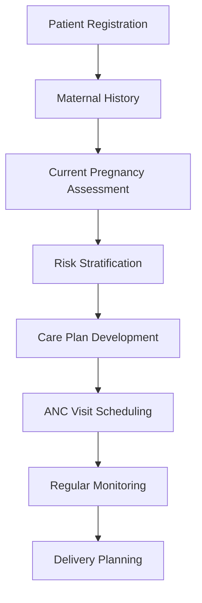
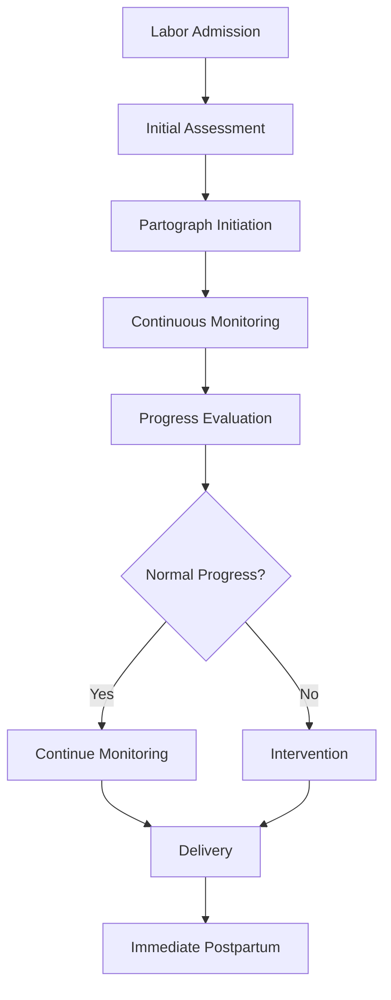
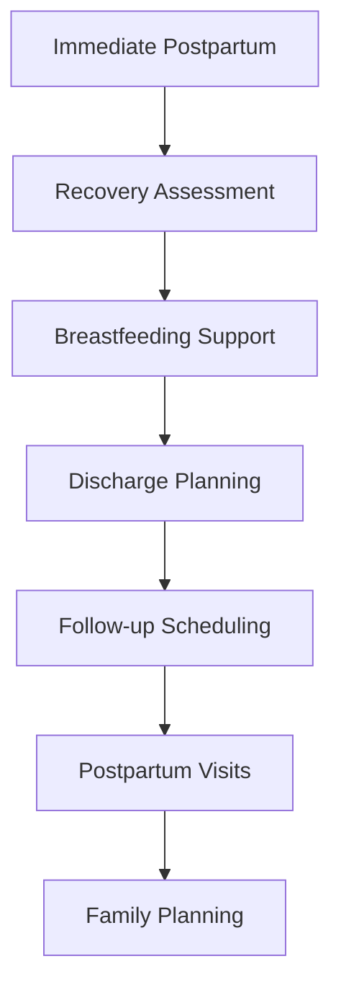

# Madre Gestante Module Documentation

## Overview

The **Madre Gestante Module** (Pregnant Mother Module) is a comprehensive maternal and child health system designed to manage the complete pregnancy journey from prenatal care through delivery and postpartum care. This module follows Peru's national maternal health guidelines and provides healthcare providers with tools for monitoring maternal health, managing labor and delivery, and ensuring proper postpartum care.

## Module Architecture

### Main Directory Structure
- **Primary Location**: `src/maternal-and-child-health/`
- **Components**: `src/maternal-and-child-health/components/`
- **Hooks**: `src/hooks/` (maternal health-specific hooks)
- **Concept Maps**: `src/maternal-and-child-health/common/concept-maps/`

## Core Components

### 1. Prenatal Care Module

#### Component Structure
- **Main Component**: `prenatal-care.component.tsx`
- **Location**: `src/maternal-and-child-health/components/prenatal-care/`

#### Three Main Sections

##### Historia Materna (Maternal History)
- **Component**: `maternalHistory.component.tsx`
- **Purpose**: Comprehensive maternal medical history
- **Features**:
  - Previous pregnancy outcomes
  - Medical conditions and complications
  - Family history relevant to pregnancy
  - Risk factor identification

##### Embarazo Actual (Current Pregnancy)  
- **Component**: `currentPregnancy.component.tsx`
- **Purpose**: Current pregnancy tracking and monitoring
- **Features**:
  - Pregnancy timeline and milestones
  - Current pregnancy complications
  - Fetal development tracking
  - Risk assessment for current pregnancy

##### Control Prenatal (Prenatal Care Chart)
- **Component**: `prenatalCareChart.component.tsx`
- **Purpose**: Visual representation of prenatal care visits
- **Features**:
  - ANC visit scheduling and tracking
  - Vital signs monitoring across visits
  - Laboratory results timeline
  - Growth and development charts

### 2. Labour & Delivery Module

#### Component Structure
- **Main Component**: `labour-delivery.component.tsx`
- **Location**: `src/maternal-and-child-health/components/labour-delivery/`

#### Three Main Sections

##### Resumen del Parto y Puerperio (Labour and Postpartum Summary)
- **Component**: `summaryOfLaborAndPostpartum.component.tsx`
- **Purpose**: Comprehensive delivery summary
- **Features**:
  - Delivery outcome documentation
  - Complications during labor
  - Newborn status at birth
  - Immediate postpartum status

##### Partos y Abortos (Deliveries and Abortions)
- **Component**: `deliveryOrAbortion.component.tsx`
- **Purpose**: Detailed delivery and pregnancy loss documentation
- **Features**:
  - Type of delivery (vaginal, cesarean)
  - Delivery complications
  - Abortion documentation when applicable
  - Medical interventions during delivery

##### Partograma (Partograph)
- **Component**: `partograph.component.tsx`
- **Location**: `src/maternal-and-child-health/components/labour-delivery/partography/`
- **Purpose**: Real-time labor monitoring tool
- **Features**:
  - **Partograph Chart**: `partograph-chart.tsx` - Visual labor progress tracking
  - Fetal heart rate monitoring
  - Cervical dilation progression
  - Descent of fetal head
  - Maternal vital signs during labor
  - Alert and action lines for decision making

### 3. Postnatal Care Module

#### Component Structure
- **Main Component**: `postnatal-care.component.tsx`
- **Location**: `src/maternal-and-child-health/components/postnatal-care/`

#### Two Main Sections

##### Puerperio Inmediato (Immediate Postpartum)
- **Component**: `immediatePostpartum.component.tsx`
- **Purpose**: Immediate postpartum care (0-24 hours)
- **Features**:
  - Vital signs monitoring
  - Postpartum bleeding assessment
  - Breastfeeding initiation
  - Maternal-infant bonding assessment
  - Early complication detection

##### Control del Puerperio (Postpartum Control)
- **Component**: `postpartumControl.component.tsx`
- **Purpose**: Extended postpartum care monitoring
- **Features**:
  - Follow-up visit scheduling
  - Postpartum recovery assessment
  - Contraception counseling
  - Mental health screening
  - Breastfeeding support

## Business Logic Hooks

### Prenatal Care Hooks

#### useCurrentPregnancy
- **Location**: `src/hooks/useCurrentPregnancy.ts`
- **Purpose**: Manages current pregnancy data and calculations
- **Key Functions**:
  - Pregnancy dating and gestational age calculation
  - Expected delivery date computation
  - Current pregnancy status tracking
  - Risk factor assessment

#### usePrenatalCare
- **Location**: `src/hooks/usePrenatalCare.ts`
- **Purpose**: Fetches and manages prenatal care encounters
- **Key Functions**:
  - ANC visit data retrieval
  - Prenatal encounter management
  - Visit scheduling and tracking
  - Clinical data aggregation

#### usePrenatalAntecedents
- **Location**: `src/hooks/usePrenatalAntecedents.ts`
- **Purpose**: Manages maternal history and antecedents
- **Key Functions**:
  - Previous pregnancy history
  - Medical condition tracking
  - Family history management
  - Risk factor identification

### Labour & Delivery Hooks

#### usePartograph
- **Location**: `src/hooks/usePartograph.ts`
- **Purpose**: Manages partograph data for labor monitoring
- **Key Functions**:
  - Labor progress tracking
  - Fetal heart rate monitoring
  - Cervical dilation recording
  - Alert system for complications
  - Decision support for interventions

### Postnatal Care Hooks

#### usePostpartumControl
- **Location**: `src/hooks/usePostpartumControl.ts`
- **Purpose**: Manages postpartum care data and follow-up
- **Key Functions**:
  - Postpartum visit scheduling
  - Recovery milestone tracking
  - Complication monitoring
  - Follow-up care coordination

#### useInmmediatePostpartum
- **Location**: `src/hooks/useInmmediatePostpartum.ts`
- **Purpose**: Immediate postpartum care management
- **Key Functions**:
  - Immediate postpartum assessment
  - Vital signs monitoring
  - Early complication detection
  - Breastfeeding initiation support

## Data Models and Concept Maps

### Concept Maps
The module uses standardized medical concept mappings for data consistency:

#### Prenatal Care Concepts
- **Location**: `src/maternal-and-child-health/common/concept-maps/prenatal-care-concepts-map.ts`
- **Contains**:
  - ANC visit concepts
  - Maternal vital signs
  - Laboratory test concepts
  - Risk factor classifications
  - Pregnancy milestone concepts

#### Labour & Delivery Care Concepts
- **Location**: `src/maternal-and-child-health/common/concept-maps/labour-and-delivery-care-concepts-map.ts`
- **Contains**:
  - Labor progress indicators
  - Delivery type classifications
  - Complication concepts
  - Intervention concepts
  - Newborn status concepts

#### Postnatal Care Concepts
- **Location**: `src/maternal-and-child-health/common/concept-maps/postnatal-care-concepts-map.ts`
- **Contains**:
  - Postpartum recovery indicators
  - Breastfeeding concepts
  - Contraception concepts
  - Mental health screening concepts

## Dashboard Configuration

### Dashboard Meta Configuration
- **Location**: `src/maternal-and-child-health/dashboard.meta.tsx`
- **Navigation Group**: "Madre Gestante"

### Three Main Dashboards

#### 1. Prenatal Dashboard
- **Name**: "Cuidados Prenatales" (Prenatal Care)
- **Purpose**: Complete prenatal care management
- **Components**: Maternal history, current pregnancy, prenatal care chart

#### 2. Labour & Delivery Dashboard  
- **Name**: "Atención del Parto" (Labor and Delivery Care)
- **Purpose**: Labor monitoring and delivery management
- **Components**: Labor summary, delivery documentation, partograph

#### 3. Postnatal Dashboard
- **Name**: "Puerperio" (Postpartum Period)
- **Purpose**: Postpartum care and recovery monitoring
- **Components**: Immediate postpartum care, postpartum control

## Clinical Integration

### Clinical Encounter Integration
- **Maternal Summary**: `src/clinical-encounter/summary/maternal-summary/maternal-summary.component.tsx`
- **Purpose**: Integrated maternal health summary within clinical encounters
- **Features**:
  - Quick overview of maternal health status
  - Current pregnancy information
  - Risk factors and alerts
  - Recent care activities

### Patient Eligibility
- **Target Population**: Female patients enrolled in maternal health programs
- **Program Enrollment**: 
  - "Madre Gestante" program
  - "Otras Estrategias Obstetricas" program
- **Automatic Display**: Module appears automatically for eligible patients

## Key Features

### 1. Comprehensive Prenatal Tracking

#### ANC Visit Management
- **Visit Numbering**: Sequential ANC visit tracking
- **Gestational Age**: Automatic calculation based on LMP or ultrasound
- **Risk Assessment**: Continuous risk factor evaluation
- **Care Planning**: Individualized care plan development

#### Laboratory Integration
- **HIV Testing**: Integrated HIV screening and counseling
- **Syphilis Screening**: VDRL/RPR testing and treatment tracking
- **Urine Analysis**: Proteinuria and infection screening
- **Blood Tests**: Hemoglobin, blood type, and other routine tests

#### Clinical Monitoring
- **Vital Signs**: Blood pressure, weight, height tracking
- **Fetal Assessment**: Fetal heart rate, movement, positioning
- **Growth Monitoring**: Fundal height and estimated fetal weight
- **Complication Screening**: Pre-eclampsia, gestational diabetes, etc.

### 2. Advanced Labor Monitoring

#### Partograph Features
- **Visual Progress Tracking**: Graphical representation of labor progress
- **Alert Systems**: Automatic alerts for prolonged labor
- **Decision Support**: Evidence-based intervention recommendations
- **Multi-parameter Monitoring**: Simultaneous tracking of multiple parameters

#### Labor Parameters
- **Cervical Dilation**: Progress tracking with time intervals
- **Fetal Descent**: Station and position monitoring
- **Fetal Heart Rate**: Continuous or intermittent FHR monitoring
- **Uterine Contractions**: Frequency, duration, and intensity
- **Maternal Vitals**: Blood pressure, pulse, temperature

### 3. Comprehensive Postpartum Care

#### Immediate Postpartum (0-24 hours)
- **Vital Signs Monitoring**: Frequent vital sign assessment
- **Bleeding Assessment**: Lochia monitoring and hemorrhage prevention
- **Breastfeeding Support**: Lactation initiation and support
- **Pain Management**: Postpartum pain assessment and management
- **Infant Assessment**: Initial newborn health evaluation

#### Extended Postpartum Care
- **Recovery Milestones**: Tracking of recovery progress
- **Contraception Counseling**: Family planning discussion and provision
- **Mental Health Screening**: Postpartum depression screening
- **Immunization**: Maternal immunization updates
- **Follow-up Scheduling**: Systematic follow-up care planning

## Data Management

### Data Storage
- **OpenMRS FHIR**: Standardized data format
- **Real-time Updates**: Live data synchronization
- **Data Validation**: Client and server-side validation
- **Audit Trail**: Complete change tracking

### Data Retrieval
- **SWR Integration**: Efficient data fetching and caching
- **Real-time Updates**: Automatic data refresh
- **Error Handling**: Robust error management
- **Performance Optimization**: Optimized queries and caching

### Form Management
- **Dynamic Forms**: Context-sensitive form rendering
- **Validation Rules**: Medical and business rule validation
- **Data Mapping**: Automatic concept mapping
- **Multi-language Support**: Spanish and English interfaces

## Technical Architecture

### Frontend Technology Stack
- **React**: Component-based UI framework
- **TypeScript**: Type-safe development
- **SCSS Modules**: Component-scoped styling
- **SWR**: Data fetching and state management

### Backend Integration
- **OpenMRS REST API**: Primary data interface
- **FHIR Resources**: Standardized healthcare data exchange
- **Concept Dictionary**: Medical concept management
- **Form Engine**: Dynamic form rendering and validation

### Responsive Design
- **Mobile Compatibility**: Touch-friendly interface
- **Tablet Optimization**: Optimal viewing on tablets
- **Desktop Interface**: Full-featured desktop experience
- **Accessibility**: WCAG 2.1 compliance

## Clinical Workflows

### Prenatal Care Workflow

### Labor and Delivery Workflow

### Postpartum Care Workflow

## Quality Assurance

### Data Quality
- **Validation Rules**: Comprehensive data validation
- **Consistency Checks**: Cross-reference validation
- **Completeness Monitoring**: Missing data identification
- **Accuracy Verification**: Clinical guideline compliance

### Clinical Guidelines
- **Peru MOH Standards**: Compliance with national guidelines
- **WHO Recommendations**: International best practices
- **Evidence-based Care**: Current medical evidence integration
- **Quality Indicators**: Performance monitoring metrics

### User Training
- **Module Training**: Comprehensive user training programs
- **Clinical Protocols**: Standardized care protocols
- **Decision Support**: Built-in clinical guidance
- **Continuous Education**: Ongoing training and updates

## Troubleshooting

### Common Issues

#### Data Display Problems
1. **Missing Data**: Check patient enrollment in maternal programs
2. **Incorrect Dates**: Verify pregnancy dating and LMP
3. **Form Errors**: Validate required field completion
4. **Loading Issues**: Check network connectivity and server status

#### Partograph Issues
1. **Chart Not Loading**: Refresh browser and check data availability
2. **Incorrect Plotting**: Verify time intervals and measurements
3. **Alert Not Triggering**: Check alert configuration and thresholds
4. **Print Problems**: Verify printer settings and browser compatibility

#### Integration Problems
1. **Appointment Sync**: Check appointment service integration
2. **Lab Results**: Verify laboratory system connectivity
3. **Form Submission**: Check form validation and server connectivity
4. **User Permissions**: Verify user roles and module access

### Support Resources
- **User Manual**: Comprehensive user documentation
- **Clinical Protocols**: Standard operating procedures
- **Technical Support**: IT helpdesk and support tickets
- **Training Materials**: Video tutorials and user guides

---

*This documentation provides comprehensive coverage of the Madre Gestante Module functionality within the ESM Sihsalus application. For specific implementation details and customization options, refer to the technical documentation and configuration guides.*